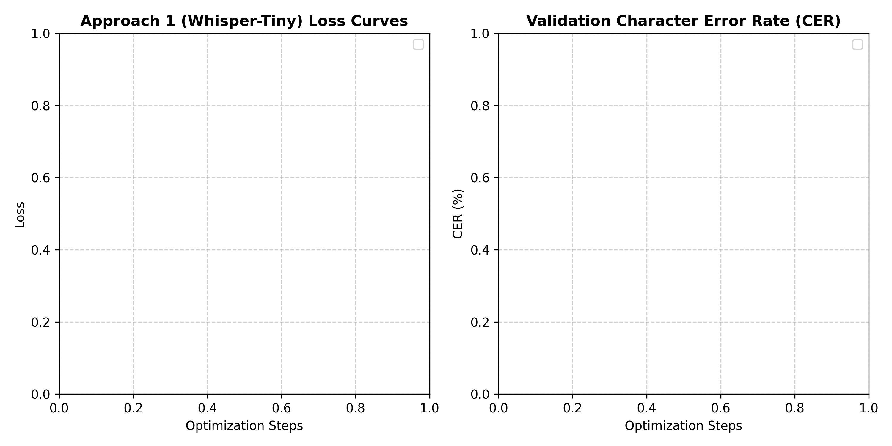
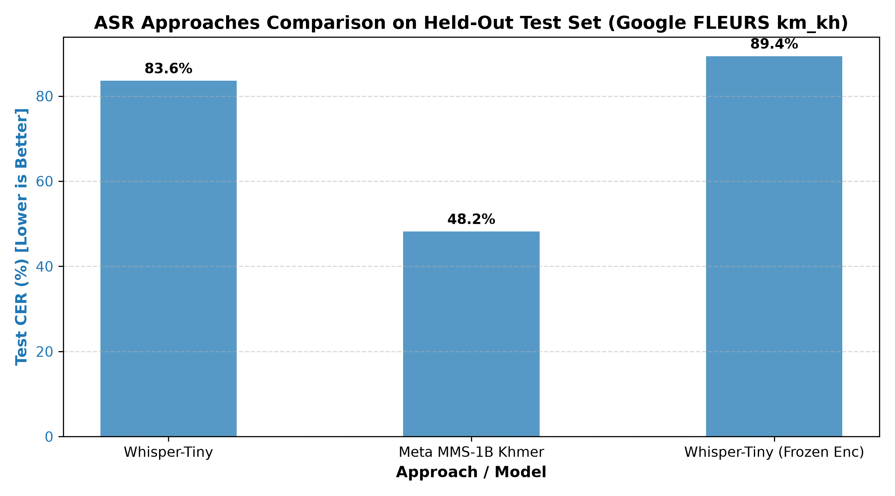

# Khmer Automatic Speech Recognition

Individual Deep Learning final project comparing a fine-tuned Whisper-Tiny Seq2Seq model with a Meta MMS CTC acoustic model on Khmer speech.

**Course:** Deep Learning Final Project, 2026-2027  
**Lecturer:** Mr. Soklong HIM  
**Student:** Khemrak Pasey

> **Experiment status:** Historical checkpoints tested on the first 200 FLEURS test rows remain diagnostic because their training selections differed. A later controlled rerun used one saved 531/124/114 train/validation/test manifest for both architectures. Whisper-Tiny and MMS both completed training; MMS achieved 15.84% held-out test CER using its best validation checkpoint. The professor approved the topic and, according to the student, now expects performance above 80%, but did not define the metric or certify these results.

## Problem

Given a 16 kHz Khmer speech waveform, predict its Khmer Unicode transcript. Khmer text uses spaces mainly at phrase boundaries, so this project reports character error rate (CER) after NFC normalization and whitespace removal. Standard unsegmented word error rate is not used as the primary metric.

## Data

The project uses the public Google FLEURS `km_kh` configuration from [Hugging Face Datasets](https://huggingface.co/datasets/google/fleurs). The dataset card identifies the FLEURS source and licensing terms. The downloaded version in this workspace contains 1,675 training, 326 validation, and 771 test examples. FLEURS supplies official splits; no speaker-level or class distribution applies to this transcription task. Audio is mono at 16 kHz. Known limits include the small amount of Khmer speech relative to high-resource languages and variation in speaker, recording, and topic.

The original Whisper run did not save its exact selected row indices. Its trainer state records 354 updates over three epochs with batch size 8, consistent with 941 usable training rows. Applying its documented label filter to a seed-42 shuffled 1,000-row FLEURS selection leaves exactly 941 rows. Its validation throughput similarly matches 189 retained rows from the first 200. These are strong inferences, not a preserved split manifest. The saved MMS training code selected the first 1,000 training rows without shuffling and removed clips over 10 seconds; its actual retained row count and training history were not saved. The two runs therefore cannot be treated as trained on the same examples.

## Approaches

| Approach | Architecture | Saved training strategy |
|---|---|---|
| Whisper-Tiny | Encoder-decoder Transformer with cross-attention | Full fine-tuning |
| Meta MMS-1B Khmer | Wav2Vec 2.0 with CTC output | Top four Transformer layers plus CTC head/adapter unfrozen; SpecAugment enabled |

The MMS run is **not adapter-only tuning**. The saved MMS weights contain about 964.8M parameters, with approximately 79.1M trainable under the recorded top-four-layer training configuration. The frozen-encoder Whisper ablation is excluded because this workspace has no saved checkpoint or evaluation metrics for it.

The original Whisper training arguments show 3 epochs, learning rate `1e-5`, 500 warmup steps, batch size 8, and gradient accumulation 1. It ended after 354 updates, before warmup finished. The MMS arguments show 15 epochs, learning rate `5e-5`, 50 warmup steps, batch size 1, and gradient accumulation 8. A separate Whisper rerun with 35 warmup steps is documented below. The repository still does not retain a learning-rate and regularization sweep.

## Results

All listed checkpoints were scored on the same first 200 examples of the FLEURS test split. CER applies NFC normalization, removes U+200B and U+FEFF, and removes whitespace before scoring. The 35-step-warmup Whisper rerun used the seed-42 shuffled first 1,000 training rows (941 retained after label filtering) and first 200 validation rows (189 retained).

| Approach | Trainable parameters | Training evidence | Epochs | Test CER (first 200) |
|---|---:|---|---:|---:|
| Original Whisper-Tiny | 37.8M | About 941 / 189 retained, inferred from run logs | 3 | **83.89%** |
| Whisper-Tiny, 35-step warmup rerun | 37.8M | 941 train / 189 validation retained | 3 | **83.67%** |
| Meta MMS-1B CTC, top four layers unfrozen | 79.1M | 1,000 train / 200 validation requested; retained counts unlogged | 15 | **15.96%** |

The Whisper rerun saved only 59 fewer character edits over 26,763 reference characters than the original: 22,392 versus 22,451. Among 200 clips, 92 improved, 84 worsened, and 24 tied. A paired utterance bootstrap interval for the CER improvement includes zero (`-0.49` to `+0.92` percentage points), so the observed `0.22`-point gain is too small to establish a reliable improvement. The result files retain both sets of Whisper predictions and the comparison details. MMS still has the much lower saved CER, while the differing training selections limit any architecture claim.

### Figures and learning-curve evidence





The original Whisper trainer state contains training loss and validation logs. Its historical validation CER retained spaces, while the post-hoc test CER removes whitespace; the two CER series therefore use different text policies. The warmup rerun's trainer state is saved in `results/whisper_warmup35_trainer_state.json`, with validation CER of 88.54%, 86.71%, and 83.62% after epochs one through three. MMS trainer history was not retained, so its learning curve cannot be reconstructed. The current figure shows the original Whisper history only.

`results/error_analysis.md` reports 13,424 substitutions, 8,741 deletions, and 286 insertions across the 200 Whisper examples, plus five high-error examples. Several outputs show repeated-token decoding failures. The report avoids assigning an acoustic cause without listening to each audio clip. MMS per-example predictions were not saved, so the current error analysis covers Whisper only.

## Training and evaluation

### Install

Use Python 3.10 or 3.11 with a CUDA GPU for training the MMS-1B model. Install the listed packages with:

```bash
pip install -r requirements.txt
```

The controlled rerun is complete. Use `notebooks/khmer_asr_experiments.ipynb` on a Google Colab GPU to reproduce it. The commands below prepare the same saved row list for both models. The historical scores above remain diagnostic.

### Matched rerun

```bash
# One shared list of eligible official FLEURS rows for both models.
python src/matched_fleurs.py --output results/matched_fleurs_split.json \
  --seed 42 --train-candidates 1000 --validation-candidates 200 \
  --test-start 200 --test-candidates 200 --max-duration-seconds 15

# Whisper-Tiny: train, validate, and test on the shared row list.
python src/finetune_whisper.py \
  --output-dir ./models/whisper-tiny-khmer-matched \
  --model-name openai/whisper-tiny --use-fleurs-train --skip-ddd \
  --split-manifest results/matched_fleurs_split.json \
  --metrics-output results/whisper_matched_metrics.json \
  --trainer-state-output results/whisper_matched_trainer_state.json \
  --seed 42 --num-train-epochs 3 --learning-rate 1e-5 --weight-decay 0 \
  --warmup-steps 35 --per-device-train-batch-size 1 \
  --per-device-eval-batch-size 4 --gradient-accumulation-steps 8 \
  --eval-steps 67 --save-steps 67 --fp16

# MMS CTC: use the identical row list and a new checkpoint folder.
python src/train_mms.py \
  --output-dir ./models/mms-khmer-ctc-matched \
  --model-id facebook/mms-1b-all --target-lang khm \
  --split-manifest results/matched_fleurs_split.json \
  --metrics-output results/mms_matched_metrics.json \
  --trainer-state-output results/mms_matched_trainer_state.json \
  --seed 42 --num-train-epochs 15 --learning-rate 3e-5 --weight-decay 0 \
  --unfreeze-top-layers 4 --apply-spec-augment --lr-scheduler-type cosine \
  --warmup-steps 50 --per-device-train-batch-size 1 \
  --per-device-eval-batch-size 1 --gradient-accumulation-steps 8 --fp16

# After both runs: save every prediction and create figures from the new evidence.
python src/evaluate_saved_whisper.py --model-dir models/whisper-tiny-khmer-matched \
  --split-manifest results/matched_fleurs_split.json \
  --output results/whisper_matched_predictions.json --device cuda
python src/evaluate_saved_mms.py --model-dir models/mms-khmer-ctc-matched \
  --split-manifest results/matched_fleurs_split.json \
  --output results/mms_matched_predictions.json --device cuda
python src/plot_matched_results.py --completed
```

The manifest removes recordings over 15 seconds and examples exceeding Whisper's label limit before either model trains. It records the exact retained indices. The new held-out test candidate rows start at index 200 because the earlier work repeatedly inspected rows 0–199. The matched output folders preserve the older local checkpoints. The Colab notebook includes three short MMS pilot runs: baseline, a lower learning rate, and weight decay. Pilot runs use validation only and save no large weights; the selected 3e-5 learning rate and zero weight decay went into the full MMS run. `--no-apply-spec-augment` is also available for a later regularization comparison. Final checkpoints and evidence are in Google Drive as shown in the notebook.

### Completed matched run: verified test evidence

The September 23–24 Colab run used one saved 531/124/114 train/validation/test manifest for both architectures. The manifest in `results/matched_fleurs_split.json` was regenerated locally and its train, validation, and test index hashes match the Drive copy exactly. Whisper-Tiny completed 3 epochs and scored **86.93% CER** on the 114 held-out clips. The 15-epoch MMS run was interrupted at step 800, then resumed and completed at step 1005. Its best validation checkpoint remained step 300 (14.45% validation CER); scored once on the same 114 held-out clips, it reached **15.84% test CER**. The final-step validation CER was 14.70%, so the extra training did not improve the selected model. CER uses NFC normalization and removes U+200B/U+FEFF and whitespace. It is an edit-distance rate, not a percentage of fully correct sentences.

See `results/mms_matched_best300_summary.json` and `results/mms_matched_best300_error_analysis.md` for the saved summary and observed failure patterns. The 26 references containing Latin letters scored 23.75% corpus CER, versus 13.03% for the other 88; this is a descriptive failure breakdown, not a separate headline test score. The 114 raw reference/prediction pairs and full MMS trainer state are preserved in Google Drive under `MyDrive/khmer_asr_final_runs/results/`; they still need to be copied into this repository before submission. To repeat the test evaluation, use `src/evaluate_saved_mms.py` with `--processor-id facebook/mms-1b-all`, the best checkpoint as `--model-dir`, and the shared split manifest. The lecturer's above-80% target lacks a specified metric. One minus CER is 84.16% on the FLEURS test set, which clears 80% as character correctness under this scoring policy; it is not sentence accuracy and does not describe the separate recordings.


These completed-run figures can be regenerated with `python src/plot_matched_results.py --completed`. The plotted history is a four-decimal copy of the full Trainer state in Drive. The Whisper trainer state also remains in Drive for a combined curve figure before submission.

### User-recorded voice check

The saved MMS checkpoint-300 was also run without transcript correction on 11 separate Telegram recordings. Ten recordings could be matched to the student's previously pasted draft transcripts; one had no reference and was excluded from scoring. On those ten, CER was **23.74%** after NFC normalization and whitespace removal (**22.00%** when punctuation was also removed). The earlier app output scored 24.17% against the same drafts. This 0.43-point difference is too small to claim that the new checkpoint improved real-world speech recognition, especially because the exact spoken wording has not been independently verified. The error pattern remains visible in names, numbers, and ordinary Khmer words. See `results/user_recordings_checkpoint300_summary.json` for aggregate evidence. The audio and personal transcripts are excluded from this public repository.

For another private recording check, run `src/evaluate_saved_mms_user_audio.py` with `--audio-dir`, `--model-dir`, and `--output`, then score only recordings with verified references using `src/score_user_audio.py`. Keep audio, raw predictions, and personal transcripts outside Git.

### Inference demo

Run `python app.py`, then open `http://127.0.0.1:7860`. The Windows launcher is `run_app.bat`. The app prefers `models/mms-khmer-ctc-matched` when installed; otherwise the current local demo loads the older `models/mms-khmer-ctc` checkpoint, not the matched-run checkpoint behind the 15.84% FLEURS CER. Do not present a live demo result as a direct demonstration of the new test score until the selected checkpoint is installed for the app. Saved model files are ignored by Git.

## Repository map

- `src/finetune_whisper.py`: Whisper training and evaluation pipeline.
- `src/train_mms.py`: MMS CTC training pipeline.
- `src/matched_fleurs.py`: Saves one fixed FLEURS row selection for both approaches.
- `src/evaluate_saved_whisper.py`: Auditable Whisper scoring on the first N test rows.
- `src/evaluate_saved_mms.py`: Auditable MMS scoring on the same rows.
- `src/evaluate_saved_mms_user_audio.py`: Raw checkpoint inference on private recordings.
- `src/plot_matched_results.py`: Figures from completed matched runs.
- `src/evaluate_and_plot.py`: Generates the summary table, JSON, and figures from saved results.
- `notebooks/khmer_asr_experiments.ipynb`: Colab workflow.
- `results/`: Saved scores, predictions, and figures.
- `slides/khmer_asr_presentation.pptx`: 13-slide final project presentation.
- `output/khmer_asr_teacher_progress_short.pptx`: 9-slide progress review for the lecturer.
- `app.py`: Gradio inference interface.

## Model weights

Large model files are excluded from Git by `.gitignore`. The matched-run MMS score comes from checkpoint-300 in Google Drive at `MyDrive/khmer_asr_final_runs/mms-khmer-ctc-matched/checkpoint-300/`; the older diagnostic checkpoints are stored locally under `models/`. After training completed, Trainer loaded the best validation weights into the top-level Drive folder `mms-khmer-ctc-matched`, which also contains the processor files. Copy that whole top-level folder to `models/mms-khmer-ctc-matched` for the app; the app prefers it over the older local model. Cloning this repository alone does not reproduce the saved-model demo. The app falls back to the public `facebook/mms-1b-all` base model if no local MMS folder exists. Whisper weights are also expected at [Hugging Face: Seypa-47/whisper-tiny-khmer](https://huggingface.co/Seypa-47/whisper-tiny-khmer), but that link returned HTTP 401 during this review; access must be made public or an authorized download method supplied before submission.

## References

1. Radford, A. et al. (2023). *Robust Speech Recognition via Large-Scale Weak Supervision*. ICML.
2. Pratap, V. et al. (2023). *Scaling Speech Technology to 1,000+ Languages*. Meta AI Research.
3. Conneau, A. et al. (2023). *FLEURS: Few-shot Learning Evaluation of Universal Representations of Speech*. IEEE SLT.
4. Graves, A. et al. (2006). *Connectionist Temporal Classification: Labelling Unsegmented Sequence Data with Recurrent Neural Networks*. ICML.
5. Wolf, T. et al. (2020). *Transformers: State-of-the-Art Natural Language Processing*. EMNLP.

## AI assistance disclosure

**Tools used:** Antigravity AI Assistant and Codex AI assistant. **Scope:** project review, debugging support, evaluation/error-analysis code, and documentation/presentation edits. **Verification:** the student must personally verify the training runs, understand and be able to modify the submitted code, and add any other tools used. Training results are reported only when backed by saved logs or predictions.

## Submission readiness checklist

- [x] Topic approval: confirmed by the lecturer (per student).
- [x] Two distinct trained deep learning architectures are present.
- [x] Run both approaches using the same train, validation, and test subsets; both runs completed.
- [x] Save curves and trainer state for both approaches in Drive; the MMS curve and summary are also in this repository.
- [ ] Retain prediction examples and complete error analysis for both approaches.
- [x] Run and document MMS learning-rate and weight-decay pilot comparisons on validation data.
- [ ] Verify the external Whisper weight link works without private access.
- [x] Add the student name to the project materials.
- [x] README, requirements, source code, results, and slides are present.
- [ ] Review slide claims against the final rerun results and rehearse the 10-minute presentation/Q&A.
